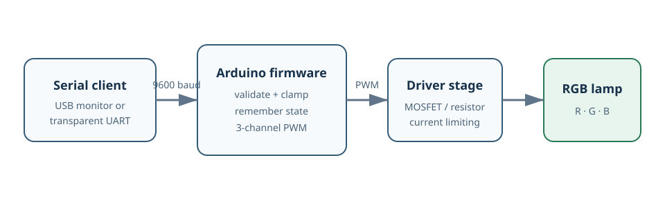

# Architecture

The public example keeps the transport and lamp control deliberately small:

1. A serial monitor or transparent Bluetooth UART module sends a text line.
2. The Arduino parser validates channel tokens and clamps PWM to `0..255`.
3. Three PWM outputs drive an external RGB LED driver stage.
4. The offline simulator mirrors the command semantics and estimates power from
   user-editable example values.

The simulator is not a circuit model. Its result is a theoretical input-power
estimate and must not be reported as a hardware measurement.
